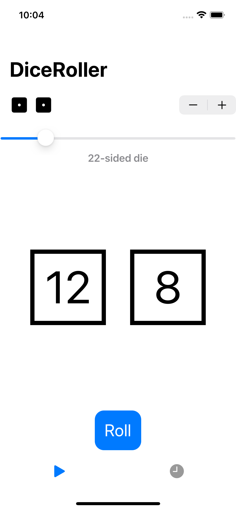
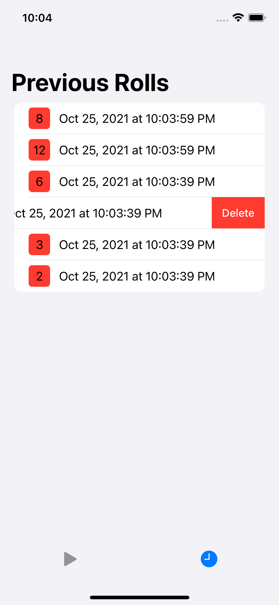

# DiceRoller
Dice Rolling Challenge iOS application done as part of the 100 Days of SwiftUI coursework: https://www.hackingwithswift.com/100/swiftui

# Description
This SwiftUI application allows the user to roll up to 4 dice, customizing the number of sides with a slider. The values are stored and shown on the history tab.
The app implements: TabView, DispatchQueue.main.async, Custom Haptics, CoreData, ViewBuilder and DateFormatter.

 

# Requirements
iOS 14.0+

